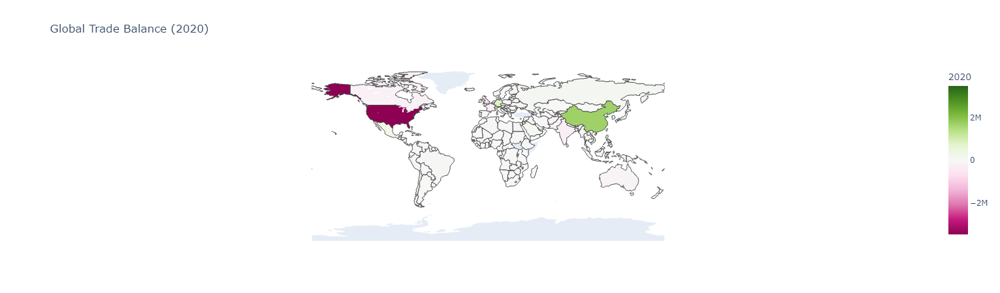
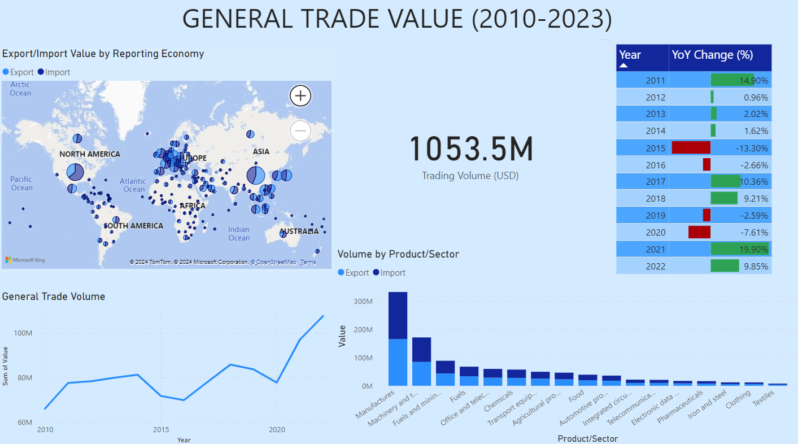
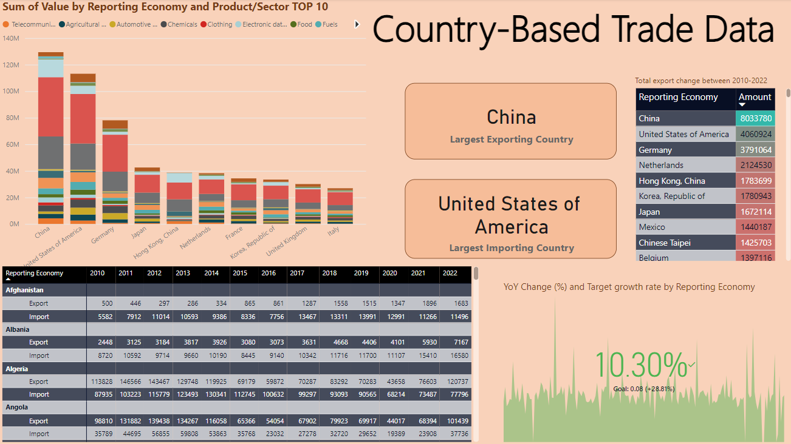

# **Annual Import and Export Trends (2010-2023)**

The WTO Stats portal contains statistical indicators related to WTO issues. Available time series cover merchandise trade and trade in services statistics (annual, quarterly and monthly), market access indicators (bound, applied & preferential tariffs), non-tariff information as well as other indicators.

Import and export data are not just mere numbers; they reflect the flow of goods, services, and capital across borders, influencing everything from economic policies to business strategies.
Understanding these trends helps identify key players in the global market, emerging industries, and shifting trade balances, offering a comprehensive view of the interconnected nature of today's global economy.

This study analyzes annual import and export data on the basis of various countries and product types between 2010 and 2023. The analysis examines countries' trade balances, annual rates of change and trade volumes. The data set includes import and export values for different years, and new features such as trade balance, trade volume, and annual change rates have been created based on these values.

